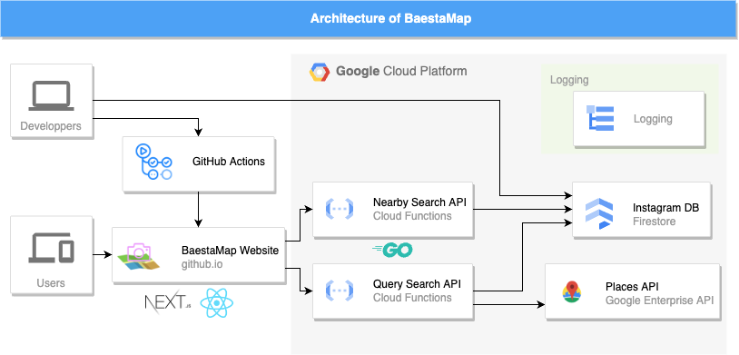

# Baesta Map

  
  <a href="https://wanwan0622.github.io/BaestaMap/">https://wanwan0622.github.io/BaestaMap/</a>

## Concept

BaestaMap(バエスタマップ)とは、気軽に”**映える**”スポットを見つけられるサービスです。  
最近では、「**ググる🔍**」ではなく「**タグる🏷**」が主流になってきています。  
おしゃれなスポットを見つけるために、インスタグラムでハッシュタグ検索をする若者も多いです。  
しかし、ハッシュタグで検索すると、実際に遊びたい場所よりも遠いところまで引っかかってしまうことがあります。  
そこで、本サービスを使用することで、ハッシュタグ検索で引っかかったものを近い順に見つけることができます。  
ぜひ、本サービスを使用して、おしゃれで映えるスポットへ足を運んでみてください🐾

## How to Use

1. 遊びたい場所を入力し、検索ボタンを押します
2. 地図上に”映える”スポットが表示されます
3. 地図の下のスポット一覧から気になるスポットを選ぶと、インスタグラムや店名、住所が表示されます

ぜひ、”**映える**”スポットで遊びましょう✨

## Architecture

  

## Link

* Website: [https://baestamap.notion.site](https://baestamap.notion.site/BaestaMap-45431cdb1eec46a0837b07437d985b64)
* [技育展 2022](https://talent.supporterz.jp/geekten/2022/)